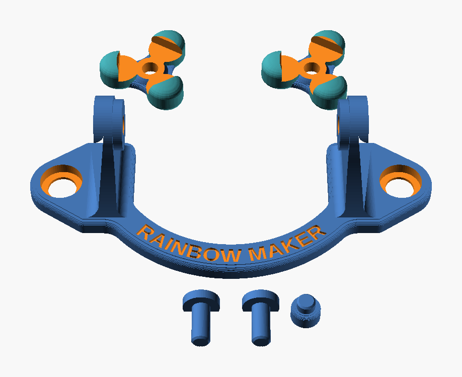
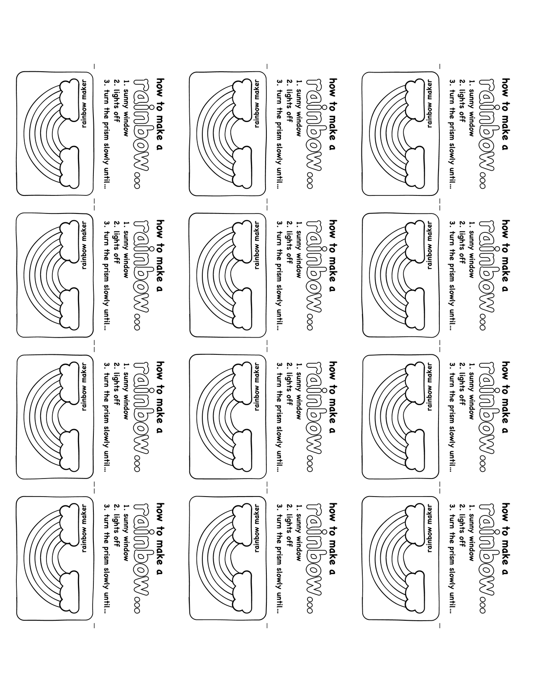

# Rainbow Maker

A 3D-printed holder that hangs a glass prism on a sunny window. Turn the prism by hand and it throws rainbows across the room. The prism sits on two pins at its balance point, so it stays at any angle you set.

<!-- TODO: add a photo of the holder on a window, and a photo of the rainbows -->

## What to buy

| Item | Qty | What to look for | Link |
|---|---|---|---|
| Glass triangular prism | 1 | Equilateral, 30–31 mm (about 1.2 in) faces, 50 mm (2 in) long | [QFkris 50 mm prisms, 12-pack](https://www.amazon.com/dp/B0CNC7DNHN) |
| Mushroom-head suction cups | 2 | About 30 mm cups. Head about 10–11 mm (0.40–0.44 in) across | [LuluEasy 30 mm suction cups, 10-pack](https://www.amazon.com/dp/B08L6Y5QX5) |

The prism pack has 12, and one sheet of party cards (below) has 12. That makes 12 party favors.

If your prism or cups are a different size, open `rainbow_maker.scad` in [OpenSCAD](https://openscad.org) and change the values in the **Prism** and **Suction cups** sections. Then export new STL files.

## What to print

All parts print in PLA with no supports and no brim. I used 0.15 mm layers, 2 perimeters and 15% infill on a Prusa MK3.

| File | Qty | Notes |
|---|---|---|
| `stl/holder.stl` | 1 | The frame with two arms. Print flat. |
| `stl/cap.stl` | 2 | Hub down, toes up. |
| `stl/pin.stl` | 2 | Prints on its side, on the flat. |
| `stl/foot.stl` | 1 | Disc down. Presses into the back of the rail so the frame cannot rock. |
| `stl/small_parts.stl` | — | The two pins and the foot on one plate (same as the three files above). |

Optional fit tools in `stl/tools/`:

- `fit_gauge.stl`: three triangle rings with different gaps. Try your prism in each one to find the right `frog_fit_in` value.
- `cup_gauge.stl`: a plate with snap holes of five sizes. Push a cup through each hole to find the right `snap_hole_in` value.

## Put it together

1. Push a cap onto each end of the prism.
2. Put the prism between the two arms of the holder.
3. Push a pin through each arm into the hole in the cap.
4. Press the foot into the hole at the bottom of the rail, on the back side.
5. Pop the suction cup heads through the two round holes.
6. Press the cups onto a window that gets direct sun.
7. Turn off the lights and turn the prism slowly until you see rainbows.

## Party cards

`cards/rainbow_cards_fold.pdf` is a sheet of 12 small fold-and-glue cards to color and give away with each Rainbow Maker. Print it single-sided on card stock. Color the rainbow, fold each strip printed side out, glue the inside, then cut along the rainbow border.

## Change the design

All parts come from one file, `rainbow_maker.scad`. Open it in OpenSCAD and use the Customizer panel. Set `part` to the piece you want, then render (F6) and export the STL. Values that end in `_in` are in inches. All other values are in mm.

## License

[CC BY-NC-SA 4.0](https://creativecommons.org/licenses/by-nc-sa/4.0/). You can print, share and remix this design. Give credit, do not sell it, and share remixes under the same license.
